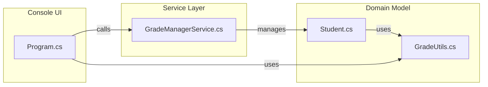
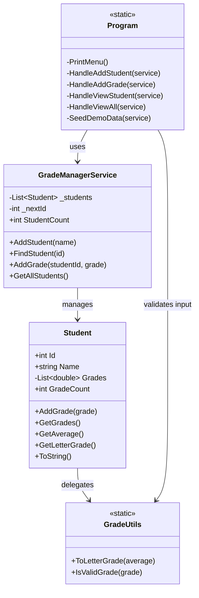
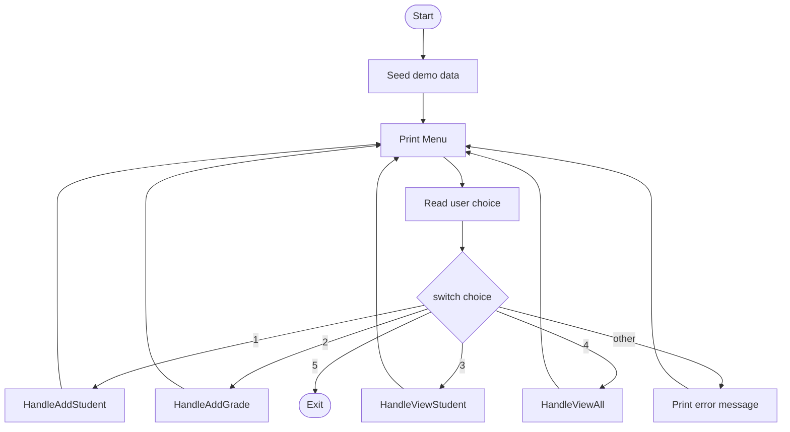

# Requirements & Design — Student Grade Management System

> **Course:** Microsoft Back-End Developer Professional Certificate — Course 1  
> **Author:** Paul Namalomba  
> **Date:** March 02, 2026  

---

## Table of Contents

1. [Requirements](#1-requirements)
2. [Design Outline](#2-design-outline)
3. [Rubric Coverage Map](#3-rubric-coverage-map)

---

## 1. Requirements

### 1.1 Problem Statement

Lecturers need a lightweight, terminal-based tool to **add students**, **record grades**, **compute averages**, and **assign letter grades** without relying on a database or GUI. The system must be easy to run on any machine with .NET 8 installed.

### 1.2 Functional Requirements

| ID   | Requirement                                             | Priority |
| ---- | ------------------------------------------------------- | -------- |
| FR-1 | Add a new student (auto-assigned unique integer ID)     | Must     |
| FR-2 | Record one or more numeric grades (0-100) per student   | Must     |
| FR-3 | View a single student's details (grades, average, letter grade) | Must |
| FR-4 | View a summary table of all enrolled students           | Must     |
| FR-5 | Validate that entered grades fall within 0-100          | Must     |
| FR-6 | Gracefully handle invalid menu choices and non-numeric input | Should |
| FR-7 | Seed demo data on startup for immediate demonstration   | Nice     |

### 1.3 Non-Functional Requirements

| ID    | Requirement                                           |
| ----- | ----------------------------------------------------- |
| NFR-1 | Runs as a .NET 8.0 console application (cross-platform) |
| NFR-2 | No external NuGet dependencies                        |
| NFR-3 | Clear separation of concerns (model / service / UI)   |
| NFR-4 | Clean code with XML doc comments                      |

### 1.4 Objectives

1. Demonstrate proficiency with **C# control structures** (`if-else`, `switch`, `while`, `for`, `foreach`).
2. Demonstrate proficiency with **methods** (static helpers, instance methods, parameterised methods with return values).
3. Apply **encapsulation** and the single-responsibility principle.
4. Produce a working console application that compiles and runs on first attempt.

---

## 2. Design Outline

### 2.1 Architecture Diagram

### 2.2 Class Diagram

### 2.3 Control Flow — Main Menu Loop

---

## 3. Rubric Coverage Map

| Rubric Criterion                        | Where It Is Demonstrated                                                  |
| --------------------------------------- | ------------------------------------------------------------------------- |
| **Control structures — if / else**      | `GradeUtils.ToLetterGrade()`, input validation in `Program.cs`            |
| **Control structures — switch**         | Main menu dispatch in `Program.cs`                                        |
| **Loops — while**                       | Main program loop in `Program.cs`                                         |
| **Loops — for**                         | `GradeManagerService.FindStudent()` iterates with a classic `for` loop    |
| **Loops — foreach**                     | `Student.GetAverage()`, `HandleViewAll()` in `Program.cs`                 |
| **Methods — with parameters**           | Every handler method accepts `GradeManagerService`; `AddGrade(double)`    |
| **Methods — with return values**        | `GetAverage() → double`, `FindStudent() → Student?`, `IsValidGrade() → bool` |
| **Methods — static**                    | All `Program.cs` helpers, all `GradeUtils` methods                        |
| **Classes & encapsulation**             | `Student` (private grade list), `GradeManagerService` (private student list) |
| **Requirements document**               | This file — Section 1                                                     |
| **Design outline with diagrams**        | This file — Section 2 (Mermaid architecture, class, and flow diagrams)    |

---

*End of document.*
